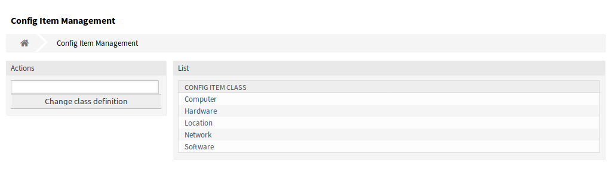
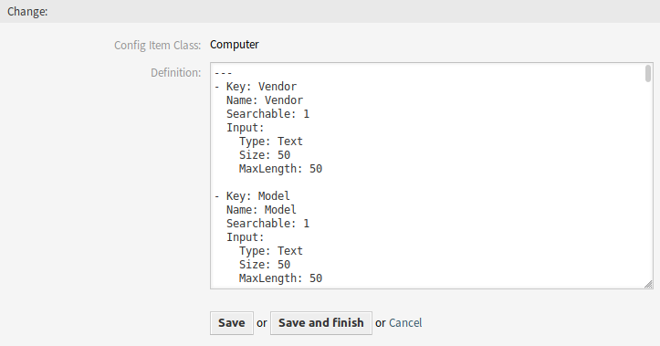
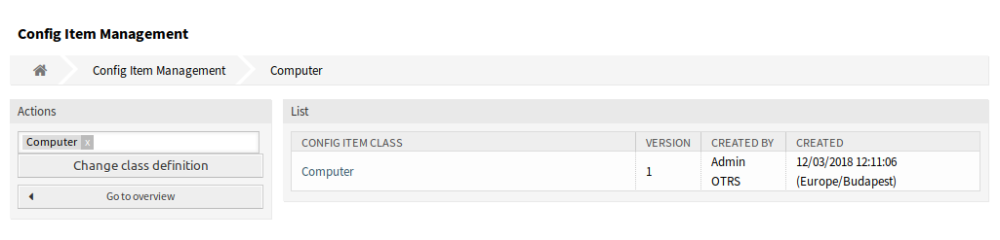

Config Items
============

Use this screen to manage class definition of configuration item classes. The configuration item class management screen is available in the *Config Items* module of the *CMDB Settings* group.

   Configuration Item Management Screen

To add or edit the class definition of a configuration item class:

1. Select a class from the drop-down menu in the left sidebar.
2. Click on the *Change class definition* button.
3. Add or edit the class definition in YAML format.
4. Click on the *Save* or *Save and finish* button.

   Edit Configuration Item Class Definition Screen

To see the class definition of a configuration item class:

1. Click on a class name in the list of classes.
2. Select a version by clicking on a class name in the list of class versions.

   
Class Definition Types and Form Elements
----------------------------------------

When defining a class, you can use multiple input types. These types are used to generate the edit form for creating new or editing already existing CIs.

See this block as an example of a form field called Vendor.

Definition example *prior to ITSM 7.0.7*

.. code-block::
 
   {
        Key => 'Vendor',
        Name => Translatable('Vendor'),
        Searchable => 1,
        Input => {
            Type => 'Text',
            Size => 50,
            MaxLength => 50,

            # Example for CI attribute syntax check for text and textarea fields
            #RegEx             => '^ABC.*',
            #RegExErrorMessage => 'Value must start with "ABC"!',
        },
.. warning::

   You should always update to the lastest version.

Current definition example. The definitions are to be written in YAML.

.. code-block::

   - Input:
       MaxLength: 50
       Size: 50
       Type: Text
     Key: Vendor
     Name: Vendor
     Searchable: 1

The basic needed elements of the CI definition are:

* Key
   Key must be machine readable. No whitespace or special charachters allowed. If this changes, data will not be readable from old definitions.
* Name
   Names can be translated by placinng the string in this format. *Translatable('Install Date')*
* Searchable
   Searchable is either 1 or not included.
* Inupt
   This has one or more sub attirbutes. See below.
   
For creating multiple instance of the same form field, for example for multiple hard drives in a computer, you must use these elements.

* Sub
   This dictactes that the follwing item, a sub item of the parent item is. This is important especially when using CountMin, CountMax, and CountDefault.
* CountMin
   An positive integer to dictate how many of these input types are available at a minimum.
* CountMax
   An positive integer to dictate how many of these input types are available at a maximum.
* CountDefault
   An positive integer to dictate how many of these input types are available per defualt.
   
Exapmle of using *sub* to define multiple elements.

.. code-block::

   - CountMax: 10
     Input:
       MaxLength: 100
       Size: 50
       Type: Text
     Key: HardDisk
     Name: Hard Disk
     Sub:
     - Input:
         MaxLength: 10
         Size: 20
         Type: Text
       Key: Capacity
       Name: Capacity

The possible types available for use are:

Text
   Any set of UTF-8 charchters, or none depending on if it's required or not.

TextArea
   Any set of UTF-8 charchters, or none depending on if it's required or not. The difference to *Text* is that *TextArea* has multiple rows for input in the edit screen.

GeneralCatalog
   This type is special, becuase you must define a general catalog class and item to use this. This items in the class are the optinos in the dropdown menu.

CustomerCompany
   Is fed from customer company backends. This allows the user to assign a customer to this CI.

Customer
   Is fed from customer user backends. This type allows the user to assign the CI to a customer user.
   
Date
   This type stores a date, and generates a date select box in the edit screen.

Each type needs and allows for certian options. These options are:

Size
   Is a positve integer. Dictates the size of the input field. Can be used in the type *Text*.

MaxLength
   Is an positve integer. Shows the maximum amount of characters which can be entered. Can be used in the type *Text*
   
Class
   Is a set UTF-8 characters. Used with the type *GeneralCatalog*. Gives the name of the class to be used for the dropdown field. **Required** for type *GeneralCatalog*
   
An exapmle of a class item.

.. code-block::

  - Input:
      Class: ITSM::ConfigItem::YesNo
      Required: 1
      Translation: 1
      Type: GeneralCatalog
    Key: IPoverDHCP
    Name: IP over DHCP
   
Required
   Is either 1 or 0. Can be used in any type. Setting this to 1 makes the setting mandatory in the frontend and for importing.
   
YearPeriodPast
   is a positive integer. To be used with the *Date* type. Dictates how many years in the past are avaiable for selection, from the present year.

YearPeriodFuture
   is a positive integer. To be used with the *Date* type. Dictates how many years in the future are avaiable for selection, from the present year.

.. seealso::

   New configuration item classes can be added in :doc:`../../../general-catalog/admin/administration/general-catalog` module in the administrator interface.
